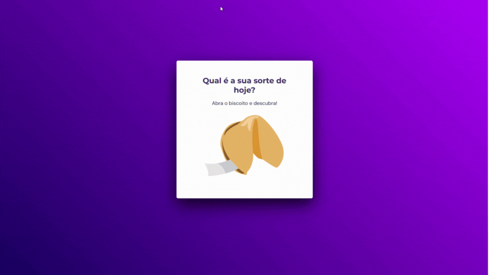

## 💻 Sobre o desafio

Neste desafio proposto no stage 04 do programa Explorer da Rocketseat foi desenvolvido um jogo chamado Biscoito da Sorte, no qual o usuário, a partir de um clique ou enter, abre um biscoito com a sua sorte do dia.

## 💡 O que será abordado nesse desafio

- Estrutura de dados HTML
- Animações com CSS
- Funções no Javascript
- Manipulação da DOM
- Biblioteca JS Math()
- Funções *callback*
- Arrays

## :wrench: Tecnologias

- HTML
- CSS
- JavaScript

---

Feito com 💜 por Victor Nascimento